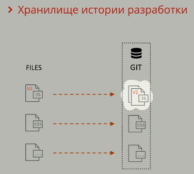

Python synopsys

Кажется, здесь можно писать markdown тексты!

```py
print('Hello, World')
n = int(input())
while n > 0:
    print(n)
    n -= 1
```
Пробую вставить картинку
Попробую сделать коммит через git bash
Все-таки попробую сделать картинку. Помещаю картинку в папку LearnGit с именем scr_1

По умолчанию картинки в Markdown не поддерживают выравнивание, и выравниваются по левому краю


Но можно использовать HTML-теги
<p align="center">
  
</p>

<details>

  <summary>Spoiler warning</summary>

  

  Spoiler text. Note that it's important to have a space after the summary tag. You should be able to write any markdown you want inside the `<details>` tag... just make sure you close `<details>` afterward.

  

  ```javascript

  console.log("I'm a code block!");

  ```

  

</details>