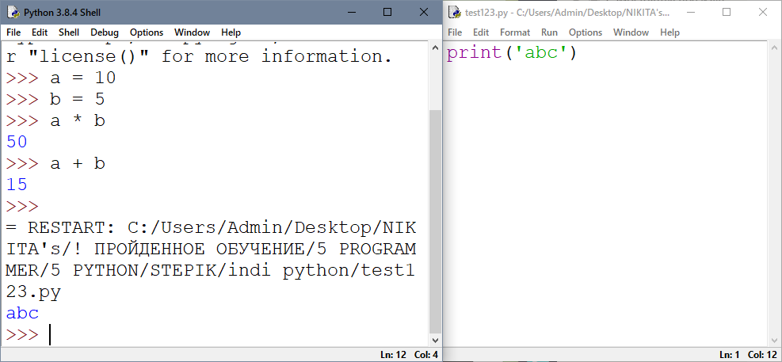

<i><h1 align="center"> Python synopsys </h1></i>

## Кратко о том, как тут все устроено. + мотивация
Как сделать, чтобы по итогу можно было искать по конспекту информацию? И надо ли. Есть ли какая-то внутритекстовая ссылочность в markdown? Может, сделать конспект сборником ссылок на хорошие статьи по теме?

как плюс можно сказать, что:
1. обзор базы по пайтон, базу надо отточить до автомата, как говорит cobezzza channel
1. статьи в интернете могут и не дать ответа на вопрос при беглом поиске, а конспект может быть более обстоятельным
1. конспект отражает мой подход к обучению, конспект можно показать
1. конспект это история успеха в обучении
1. конспект выработает подход к ведению записей при обучении, а учиться придётся всегда
1. конспект это уверенность в том, что и как глубоко знаешь, а что не знаешь

как минус можно сказать, что:
1. просираешь время вместо того, чтобы уже пилить что-то
однако:
1. мощное не запилить без базы
1. поспешишь людей насмешишь
1. не хочется регретить по поводу каких-то не отработанных топиков
\
\
\
*По мере написания сюда буду добавлять "устройство" этого документа.*

## Варианты исполнения кода.
Существует два варианта:

1. Интерактивный (консоль python, shell) — написать в меню Пуск "idle".

Инструкции выполняются в интерактивном режиме, мы сразу видим результат. Минус интерактивного режима — ничего не сохраняется после закрытия или Shell →  Restart Shell.

<p align="center">
  
</p>

2. Файловый (стандартный) — пишем инструкцию в файлик и запускаем его на исполнение.

В Shell File → New file. Записываем инструкции в файл и выполняем его в меню Run.

<p align="center">
  
</p>

## Числа и операции над ними

Программа — это набор инструкций, который описывает компьютеру определенную последовательность действий. Инструкции в программе выполняются сверху-вниз.
```py
Каждая инструкция создает или обрабатывает объект. Понятие "объект" является ключевым в python.
```

```py
b = 5 + 6  # суммируются два объекта, затем кладутся в переменную b
print('Как дела?')  # объект строка выведется как есть
print(5 > 10)  # два числа сравниваются, результатом сравнения будет объект False
```
В Python существует много встроенных объектов

<p align="center">
  
</p>

Числа в python представлены двумя типами объектов: int (целые) и float (дробные, числа с плавающей точкой).

Целые это ряд отрицательных и положительных чисел, и ноль: -5, -3, -1, 0, 1, 2, 3, 4, 5, 6, 7

Числа с плавающей точкой (дробные) отличаются от целых чисел наличием дробной части: -5.3, -3.3, -1.123, 0.5, 1.35, 2.99, 3.1415, 4.4, 5.51, 6.04, 7.7533

Над числами можно выполнять операции

<p align="center">
  
</p>
<p align="center">
  
</p>
Последние два примера поясняются равенством — основным уравнением арифметики: 100 = 35 * 2 + 30

Имеет место приоритет операций как в математике

<p align="center">
  
</p>

Также в python есть множество встроенных операций:

* abs возвращает модуль числа
* min и max возвращают минимум и максимум переданной последовательности, соответственно
* pow возводит в первый параметр в степень второго параметра

<p align="center">
  
</p>
<p align="center">
  
</p>

* round округляет
1. По правилам математики

<p align="center">
  
</p>

2. Также в round можно передать разряд, до которого нужно округлить, по правилу нумерации разрядов:

если нужно округлить до сотых

<p align="center">
  
</p>

до тысячных

<p align="center">
  
</p>

до десятых

<p align="center">
  
</p>

до целого

<p align="center">
  
</p>

до целых десятков

<p align="center">
  
</p>

<p align="center">
  
</p>

до целых сотен

<p align="center">
  
</p>

<p align="center">
  
</p>

до целых тысяч

<p align="center">
  
</p>

<p align="center">
  
</p>

    Еще раз про нумерацию разрядов чисел в python на примере числа 123.456. По указанному в качестве второго параметра функции round номеру происходит округление. Следовательно по умолчанию стоит ноль.

<p align="center">
  
</p>

* также существует функция type, которая возвращает тип объекта

<p align="center">
  
</p>

Внутри функций можно использовать другие функции

<p align="center">
  
</p>

    В python есть большое количество реализованных математических функций. подробнее о них можно почитать по ссылке на встроенный модуль math:

официальная документация: [https://docs.python.org/3/library/math.html](https://docs.python.org/3/library/math.html)

русифицированная документация: [https://docs-python.ru/standart-library/modul-math-python/](https://docs-python.ru/standart-library/modul-math-python/)

